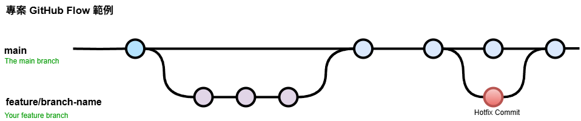

# Convention

## 專案流程

採用 GitHub Workflow



## Branch 命名

| branch prefix |    description     |
| :-----------: | :----------------: |
|    feature    |   功能、需求相關   |
|      fix      | bug 修正、調整相關 |
|   refactor    |        重構        |

## Commit Message

```plain text
<類型 type>[可選的作用範圍 scope]: <描述 description>
```

- ✔️ feat: add about page
- ✔️ fix(html): 將文章列表區塊調整成符合語意化
- ❌ 調整間距 (太簡略)

More Details: [Conventional Commits](https://www.conventionalcommits.org/zh-hant/v1.0.0/)
